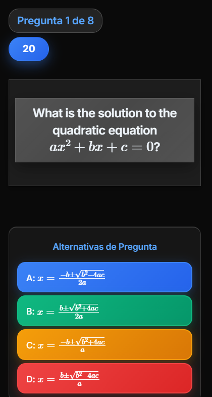

# Quizix Pro

A real-time quiz platform for classrooms and local networks. The host runs a quiz on their
computer, players join from any browser with a PIN, and everyone answers live against a shared
timer and leaderboard. Questions render LaTeX, so it works for maths and engineering material
rather than trivia alone.

Runs entirely on a LAN out of the box. Only the AI question-generation features reach the internet.

| Lobby — players join by PIN or QR | Live question with LaTeX in every option |
|---|---|
|  |  |

## Quickstart

```bash
npm install
npm start
```

1. Open `http://localhost:3000` on the host computer.
2. Click **Host a Game**, build or load a quiz, then **Start Game** — this shows a PIN and QR code.
3. On any other device on the same network, open `http://<host-IP>:3000`, click **Join Game**, and
   enter the PIN and a name. Scanning the QR code does the same thing.

The server binds to `0.0.0.0:3000`, so anything on the same Wi-Fi can reach the host machine's IP.
Find it with `ipconfig` (Windows) or `ip addr show` (macOS/Linux). Under WSL, set `NETWORK_IP`
explicitly — auto-detection picks the virtual adapter.

## Question types

| Type | Description |
|---|---|
| Multiple choice | One correct answer among several options |
| Multiple correct | Select all that apply; the selected set must match exactly |
| True / False | Binary choice |
| Numeric | Numeric answer with a configurable tolerance |
| Ordering | Drag-and-drop sequence arrangement |

Questions support LaTeX (`$x^2 + y^2 = z^2$`), images, and syntax-highlighted code blocks.
To add a new type, see [docs/ADD-QUESTION-TYPE.md](docs/ADD-QUESTION-TYPE.md).

## AI question generation

Quizzes can be generated from a prompt, a pasted URL, or an uploaded PDF, DOCX or PPTX file.

| Provider | Requires | Network |
|---|---|---|
| Claude (Anthropic) | `CLAUDE_API_KEY`, or a key supplied in the UI | Outbound |
| Gemini (Google) | `GEMINI_API_KEY`, or a key supplied in the UI | Outbound |
| Ollama | A local Ollama server | Local only |

Without a server-side key, hosts can paste their own API key in the UI; those requests are
rate-limited per IP. Ollama is the only fully offline generation path.

## Results and export

Export to CSV, XLSX (Summary / Questions / Players / Wrong Answers sheets), or a formatted PDF
report. Results from repeated runs of the same quiz can be compared side by side, and any question
can be drilled into for its answer and timing distribution.

## Accounts and organization

User accounts are optional. With one, a host can save quizzes into folders; both quizzes and
folders can be password-protected independently of accounts.

## Languages

The interface ships in nine languages — English, Spanish, French, German, Italian, Portuguese,
Polish, Japanese and Chinese — switchable at runtime without a reload. (The screenshots above are
the Spanish UI.)

## Configuration

Environment variables, via `.env` — see [.env.example](.env.example).

| Variable | Purpose | Default |
|---|---|---|
| `PORT` | Server port | `3000` |
| `BASE_PATH` | URL prefix, e.g. for an ingress | `/quizix/` in production, `/` otherwise |
| `NETWORK_IP` | Override the auto-detected LAN IP (needed under WSL) | auto-detected |
| `CLAUDE_API_KEY` | Server-side Claude key | unset |
| `CLAUDE_MODEL` | Claude model override | `claude-sonnet-4-5` |
| `GEMINI_API_KEY` | Server-side Gemini key | unset |
| `GEMINI_MODEL` | Gemini model override | `gemini-2.5-flash` |
| `OLLAMA_URL` | Ollama server address | `http://localhost:11434` |

## Commands

| Command | Purpose |
|---|---|
| `npm start` | Production server |
| `npm run dev` | Auto-restarting dev server |
| `npm run build` | Rebuild the CSS bundle and cache-bust — **required after any CSS change** |
| `npm test` | Unit tests (Jest) |
| `npm run test:coverage` | Tests with a coverage report |
| `npm run lint` | ESLint |
| `npm run format` | Prettier |

## Requirements

Node.js `^18.17.0 || ^20.3.0 || >=21.0.0`, as required by `sharp` for image processing. There is no
`engines` field in `package.json`, so nothing enforces this at install time.

## Deployment

Built for LAN use. For remote access, put it behind HTTPS with
[Docker](DOCKER.md) ([standalone](DOCKER-STANDALONE.md)) or
[Kubernetes](K8S-DEPLOYMENT-QUICK-REFERENCE.md) — see [DEPLOYMENT.md](DEPLOYMENT.md).

Exposing this directly to the internet needs work first; the open items are tracked in
[docs/FUTURE.md](docs/FUTURE.md).

## Security notes

- Uploads are validated against actual magic bytes, not the claimed MIME type, and stored under
  cryptographically random filenames.
- API keys entered in the browser are encrypted with AES-GCM before being stored.
- AI-generation and upload endpoints are rate-limited per IP; Socket.IO connections are rate-limited
  separately.
- Outbound URL fetches re-validate every redirect hop against private and internal IP ranges.

## Documentation

| Topic | Where |
|---|---|
| System design | [docs/ARCHITECTURE.md](docs/ARCHITECTURE.md) |
| REST and Socket.IO API | [docs/API_REFERENCE.md](docs/API_REFERENCE.md) |
| Scoring formula | [docs/SCORING_SYSTEM.md](docs/SCORING_SYSTEM.md) |
| Adding a question type | [docs/ADD-QUESTION-TYPE.md](docs/ADD-QUESTION-TYPE.md) |
| Known footguns | [docs/GOTCHAS.md](docs/GOTCHAS.md) |
| Roadmap and open TODOs | [docs/FUTURE.md](docs/FUTURE.md) |
| Development conventions | [CLAUDE.md](CLAUDE.md) |

## License

MIT.
