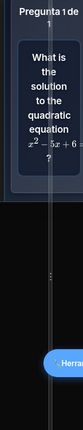

# Quizix Pro

A real-time quiz platform: a host runs a quiz on their computer, players join from any browser using a PIN, and everyone answers live with a shared timer and leaderboard. Runs on a local network out of the box; quiz generation features (Claude/Gemini) need internet.



## Quickstart

```bash
npm install
npm start
```

Then:

1. Open `http://localhost:3000` on the host computer.
2. Click **Host a Game**, build or load a quiz, click **Start Game** — this shows a PIN.
3. On any other device on the same network, open `http://<host-IP>:3000`, click **Join Game**, enter the PIN and a name.

`npm start` binds to `0.0.0.0:3000`, so anyone on the same Wi-Fi/LAN can reach the host machine's IP address. Find that IP with `ipconfig` (Windows) or `ip addr show` (Mac/Linux).

## Question types

| Type | Description |
|---|---|
| Multiple choice | Single correct answer among several options |
| Multiple correct | Select-all-that-apply |
| True/False | Binary choice |
| Numeric | Numeric answer with a configurable tolerance |
| Ordering | Drag-and-drop sequence arrangement |

Questions support LaTeX (`$x^2+y^2=z^2$`), images, and syntax-highlighted code blocks. See [docs/ADD-QUESTION-TYPE.md](docs/ADD-QUESTION-TYPE.md) to add a new type.

## AI question generation

Quizzes can be generated from a prompt, a pasted URL, or an uploaded PDF/DOCX/PPTX file.

| Provider | Requires |
|---|---|
| Claude (Anthropic) | API key — server-side `CLAUDE_API_KEY` or a client-supplied key |
| Gemini (Google) | API key — server-side `GEMINI_API_KEY` or a client-supplied key |
| Ollama | A local Ollama server (`OLLAMA_URL`, default `http://localhost:11434`) — no internet needed |

All three call out to their provider over the network except Ollama, which is local.

## Results & export

Results can be exported as CSV, XLSX (Summary/Questions/Players/Wrong-Answers sheets), or a formatted PDF report, and compared across multiple runs of the same quiz.

## Accounts and organization

Optional user accounts (`routes/auth.js`) let a host save quizzes to folders, and both quizzes and folders can be password-protected independently of accounts.

## Configuration

Set via environment variables (see `.env.example`):

| Variable | Purpose | Default |
|---|---|---|
| `PORT` | Server port | `3000` |
| `BASE_PATH` | URL prefix, e.g. `/quizix/` for a K8s ingress | `/` |
| `NETWORK_IP` | Overrides auto-detected LAN IP (useful under WSL) | auto-detected |
| `CLAUDE_API_KEY` | Server-side Claude key, avoids client BYOK | unset |
| `CLAUDE_MODEL` | Claude model override | `claude-sonnet-4-5` |
| `GEMINI_API_KEY` | Server-side Gemini key | unset |
| `GEMINI_MODEL` | Gemini model override | `gemini-2.5-flash` |
| `OLLAMA_URL` | Ollama server address | `http://localhost:11434` |

Without a server-side key, players can still use Claude/Gemini generation by supplying their own API key in the UI (rate-limited).

## Commands

```bash
npm start              # production server
npm run dev             # nodemon, auto-restart on change
npm run build            # rebuild CSS bundle + cache-busting (required after CSS changes)
npm run build:css         # CSS only
npm test                 # jest unit tests
npm run test:watch        # jest in watch mode
npm run test:coverage     # jest with coverage report
npm run lint              # eslint
npm run lint:fix          # eslint --fix
npm run format            # prettier --write
```

## Requirements

Node.js `^18.17.0 || ^20.3.0 || >=21.0.0` — this is set by `sharp` (image processing); the rest of the dependency set does not pin an engine. `package.json` has no `engines` field, so nothing enforces this at install time.

## Deployment

Designed for LAN use by default. For remote/cloud access, put it behind HTTPS via Docker or Kubernetes:

- `DOCKER.md` / `DOCKER-STANDALONE.md`
- `K8S-DEPLOYMENT-QUICK-REFERENCE.md`, `DEPLOYMENT.md`

## Security notes

- File uploads are validated against their actual magic bytes (not just the claimed MIME type) and saved under cryptographically random filenames.
- Client-side API keys are encrypted with AES-GCM before being stored in the browser.
- AI generation and file-upload endpoints are per-IP rate-limited; Socket.IO connections are rate-limited separately.
- Outbound URL fetches (for "generate from a link") re-validate every redirect hop against private/internal IP ranges.

## Documentation

| Topic | File |
|---|---|
| System design | [docs/ARCHITECTURE.md](docs/ARCHITECTURE.md) |
| REST/Socket.IO API | [docs/API_REFERENCE.md](docs/API_REFERENCE.md) |
| Scoring formula | [docs/SCORING_SYSTEM.md](docs/SCORING_SYSTEM.md) |
| Adding a question type | [docs/ADD-QUESTION-TYPE.md](docs/ADD-QUESTION-TYPE.md) |
| Known footguns | [docs/GOTCHAS.md](docs/GOTCHAS.md) |
| Roadmap & open TODOs | [docs/FUTURE.md](docs/FUTURE.md) |
| Docker | [DOCKER.md](DOCKER.md), [DOCKER-STANDALONE.md](DOCKER-STANDALONE.md) |
| Kubernetes | [K8S-DEPLOYMENT-QUICK-REFERENCE.md](K8S-DEPLOYMENT-QUICK-REFERENCE.md), [DEPLOYMENT.md](DEPLOYMENT.md) |
| Development conventions | [CLAUDE.md](CLAUDE.md) |

## License

MIT.
